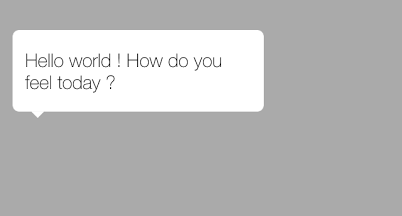

iOS custom view for displaying bubble :) 

Using MBLDialogView
--
```ObjC
- (instancetype)initWithFrame:(CGrect)frame andArrowDirection:(MBLDirection)direction andOffset:(NSIntger)o;
@param CGrect:frame             -> The frame you want to display (including the arrow)
@param MBLDirection:direction   -> The direction where your arrow is on the frame
@param andOffset:NSIntger       -> The position of the arrow
```

Sample code + result : 
-----------

```C
MBDialogView *dialogView = [[MBDialogView alloc] initWithFrame:CGRectMake(10, 420, 200, 70)
                            andArrowDirection:MBLDirectionSouth andOffset:20];
UIFont *font = [UIFont fontWithName:@"HelveticaNeue-Thin" size:15]; // light
UILabel *label = [[UILabel alloc] initWithFrame:CGRectInset([dialogView getDialogFrame], 10, 0)];
label.text = @"Hello world ! How do you feel today ?";
label.lineBreakMode = NSLineBreakByWordWrapping;
label.numberOfLines = 0;
label.font = font;
[label setTextColor:[UIColor blackColor]];
[dialogView addSubview:label];
[self.view addSubview:dialogView];
```

